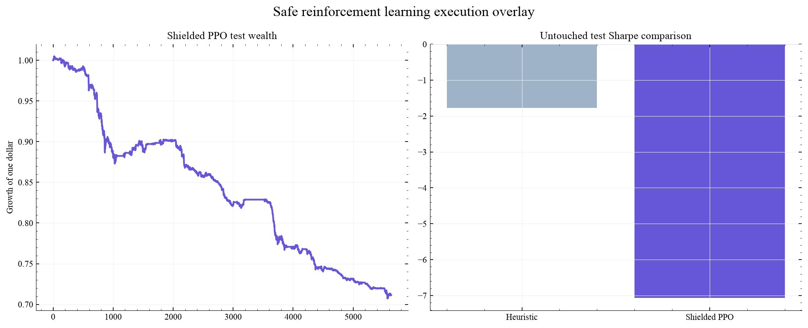
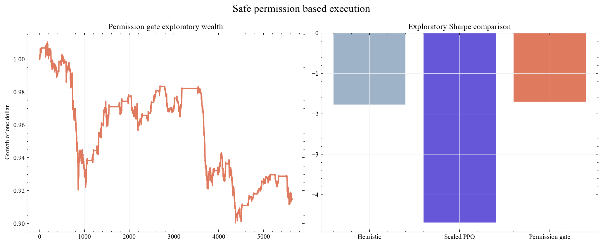
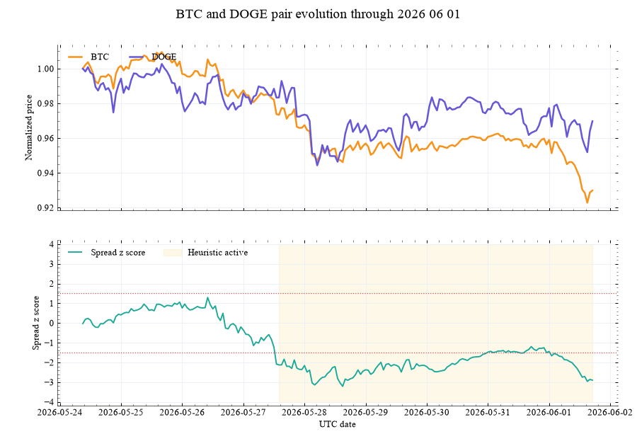

# Safe Deep Reinforcement Learning for Cryptocurrency Pair Trading

[](https://colab.research.google.com/github/am610/safe-rl-crypto-pair-trading/blob/main/notebooks/01_safe_rl_crypto_pair_trading.ipynb)

Can a reinforcement learning execution policy improve dynamic cryptocurrency pair trading after costs, selection controls, and deterministic risk limits?

This project is an independent research implementation inspired by the 2026 study by Damian Lebiedź and Robert Ślepaczuk. It will reproduce the core research logic, test simpler baselines, and examine where a learning policy adds value rather than assuming that complexity is beneficial.

## Locked heuristic baseline

The project now contains 23,175 aligned hourly observations for BTC, ETH, SOL, ADA, DOGE, and LTC from Coinbase Exchange. The chronological design uses 2024 for training, 2025 for validation, and 2026 for untouched testing.

Training selects BTC with DOGE, SOL with DOGE, and BTC with SOL. Validation selects a 336 hour lookback, a 1.5 standard deviation entry threshold, and a 0.5 standard deviation exit threshold. The test applies a one hour execution delay and ten basis points of turnover cost.

The locked heuristic performs poorly on the untouched test. Its annualized return is negative 23.6 percent, volatility is 13.3 percent, Sharpe estimate is negative 1.77, maximum drawdown is 18.0 percent, and ending wealth is 0.85. This is an informative failure rather than a profitability claim. The reinforcement learning overlay must improve upon this fixed baseline without weakening the risk controls or using test information.


## First reinforcement learning diagnostic

The first shielded PPO execution policy uses 100,000 training steps and a fixed random seed. Its actions scale the heuristic pair signals, while a deterministic shield blocks extreme spread divergence and limits simultaneous pair concentration.

This first policy fails. It remains active during 83.0 percent of test hours and produces a negative 7.07 Sharpe estimate with a 29.6 percent maximum drawdown. The shield changes 540 requested actions but cannot compensate for an agent that participates too frequently. The result identifies reward design and abstention behavior as the next research problem.



A controlled follow up compares three PPO candidates using 2025 validation performance only. Activity penalties range from 0.25 to 1.00 basis points and each candidate uses a different fixed seed. Every validation Sharpe remains negative. The selected candidate improves the exploratory 2026 Sharpe from negative 7.07 to negative 4.69 and reduces maximum drawdown from 29.6 percent to 18.2 percent, but activity remains excessive at 83.2 percent.

This evidence rejects the present action formulation. The next version will treat abstention as the default decision and require the policy to earn permission to activate a deterministic trade. Because the 2026 period was already viewed after the first PPO run, all current 2026 policy comparisons are explicitly exploratory.

## Permission gate result

The redesigned policy can only authorize or reject deterministic pair signals. It cannot choose trade direction, increase leverage, or override the risk shield. Three candidates are compared using 2025 validation results. The selected candidate achieves a validation Sharpe estimate of 0.77 and reduces validation activity to 53.9 percent.

On the exploratory 2026 period, the permission gate improves the heuristic Sharpe from negative 1.77 to negative 1.70 and reduces maximum drawdown from 18.0 percent to 10.9 percent. Ending wealth improves from 0.85 to 0.92. The improvement is economically relevant but does not establish profitability. It supports the narrower conclusion that explicit abstention and deterministic shielding are safer than unrestricted signal scaling in this experiment.



## Initial pair screen

The first experiment estimates hedge relations, spread stationarity, mean reversion speed, and pair rankings.


## Animated pair evolution

The animation uses the real Coinbase BTC and DOGE history. It follows normalized prices, the rolling spread z score, fixed entry thresholds, and the hours when the deterministic heuristic is active.



## Research notebook

[Open the executed research notebook](notebooks/01_safe_rl_crypto_pair_trading.ipynb) or launch it with the Colab button above. The notebook combines data provenance, experimental design, pair selection, the locked heuristic, PPO failure analysis, the safer permission gate, risk controls, and limitations.

## Planned research architecture

1. Real hourly cryptocurrency data with recorded provenance
2. Chronological training, validation, and untouched test periods
3. Filter then rank dynamic pair selection
4. Fixed heuristic execution baseline
5. Reinforcement learning execution overlay
6. Deterministic shielding for leverage, divergence, and drawdown risk
7. Fees, turnover, funding proxy, and execution stress tests
8. Stationary block bootstrap comparison
9. Interactive allocation and trade replay
10. Executed research notebook and Google Colab launch

## Data choice

The cited paper uses Binance USD margined futures. Direct Binance futures access is restricted in the current development location. This implementation begins with Coinbase hourly spot data and keeps the provider interface replaceable. Futures specific claims will not be made from spot data.

## Research standard

The learning agent must beat a locked heuristic on untouched data. Pair selection and model choices may use training and validation periods only. Every reported result will include implementation costs, uncertainty, stability checks, and clear limitations.

## Reproduce the current baseline

```bash
python -m pip install -e .
PYTHONPATH=src python scripts/run_real_data_screen.py
PYTHONPATH=src python -m pytest -q
```

## Reference

[Dynamic Multi Pair Trading Strategy in Cryptocurrency Markets with Deep Reinforcement Learning](https://arxiv.org/abs/2606.04574), Damian Lebiedź and Robert Ślepaczuk, 2026.
