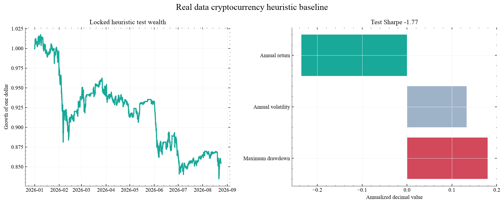
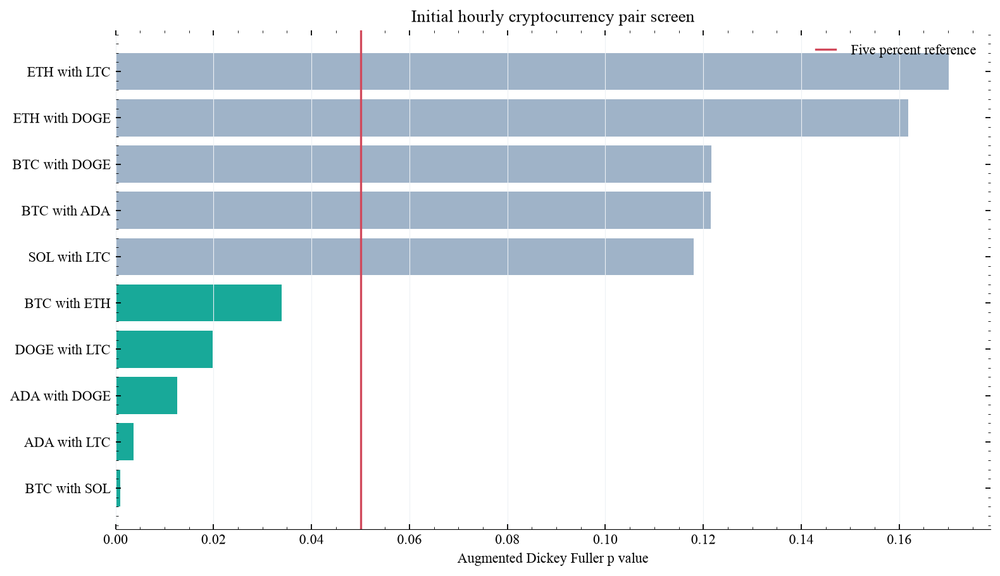

# Safe Deep Reinforcement Learning for Cryptocurrency Pair Trading

Can a reinforcement learning execution policy improve dynamic cryptocurrency pair trading after costs, selection controls, and deterministic risk limits?

This project is an independent research implementation inspired by the 2026 study by Damian Lebiedź and Robert Ślepaczuk. It will reproduce the core research logic, test simpler baselines, and examine where a learning policy adds value rather than assuming that complexity is beneficial.

## Locked heuristic baseline

The project now contains 23,175 aligned hourly observations for BTC, ETH, SOL, ADA, DOGE, and LTC from Coinbase Exchange. The chronological design uses 2024 for training, 2025 for validation, and 2026 for untouched testing.

Training selects BTC with DOGE, SOL with DOGE, and BTC with SOL. Validation selects a 336 hour lookback, a 1.5 standard deviation entry threshold, and a 0.5 standard deviation exit threshold. The test applies a one hour execution delay and ten basis points of turnover cost.

The locked heuristic performs poorly on the untouched test. Its annualized return is negative 23.6 percent, volatility is 13.3 percent, Sharpe estimate is negative 1.77, maximum drawdown is 18.0 percent, and ending wealth is 0.85. This is an informative failure rather than a profitability claim. The reinforcement learning overlay must improve upon this fixed baseline without weakening the risk controls or using test information.



## Initial pair screen

The first experiment estimates hedge relations, spread stationarity, mean reversion speed, and pair rankings.



## Planned research architecture

1. Real hourly cryptocurrency data with recorded provenance
2. Chronological training, validation, and untouched test periods
3. Filter then rank dynamic pair selection
4. Fixed heuristic execution baseline
5. Reinforcement learning execution overlay
6. Deterministic shielding for leverage, divergence, and drawdown risk
7. Fees, turnover, funding proxy, and execution stress tests
8. Stationary block bootstrap comparison
9. Interactive allocation and trade replay
10. Executed recruiter notebook and Google Colab launch

## Data choice

The cited paper uses Binance USD margined futures. Direct Binance futures access is restricted in the current development location. This implementation begins with Coinbase hourly spot data and keeps the provider interface replaceable. Futures specific claims will not be made from spot data.

## Research standard

The learning agent must beat a locked heuristic on untouched data. Pair selection and model choices may use training and validation periods only. Every reported result will include implementation costs, uncertainty, stability checks, and clear limitations.

## Reproduce the current baseline

```bash
python -m pip install -e .
PYTHONPATH=src python scripts/run_real_data_screen.py
PYTHONPATH=src python -m pytest -q
```

## Reference

[Dynamic Multi Pair Trading Strategy in Cryptocurrency Markets with Deep Reinforcement Learning](https://arxiv.org/abs/2606.04574), Damian Lebiedź and Robert Ślepaczuk, 2026.
